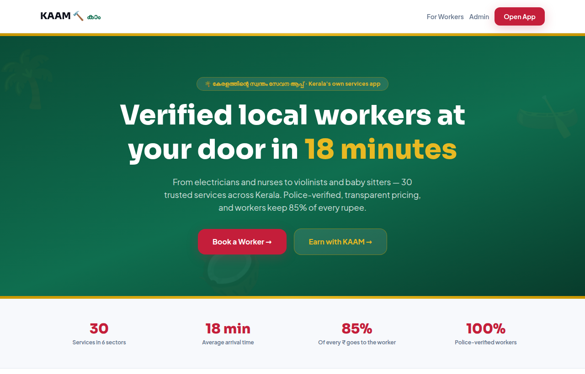

# KAAM 🔨 — Kerala's own services marketplace

**Choose your own skilled worker, and pay only when they accept.** Electricians, plumbers, nurses, violinists, baby sitters and 25 more services across all 14 Kerala districts — ID-verified, transparently priced, and workers keep 85% of every rupee.

A production-structured Next.js 16 + TypeScript + Tailwind 4 app with three surfaces (customer app, worker portal, admin console), a fully-tested pricing/tax engine, live maps, chat, an AI Advisor, and a growth/retention layer modelled on the best of Uber, Swiggy, Zomato and Urban Company.



## Quick start

```bash
npm install
npm run dev        # http://localhost:3000
npm test           # domain unit tests (vitest)
npm run test:e2e   # money & start-code flows in a real browser (playwright)
npm run build      # production build
```

`test:e2e` needs a production build first (`npm run build`); it starts the server
itself on port 3111. Every test in `e2e/` guards a defect that once shipped —
a payment that took a single tap, a start code printed on the worker's own
screen, a job that began before anyone had paid. If a change makes one of them
fail, the change is wrong, not the test.

Demo login: any 10-digit mobile or email, OTP code **`4321`**.
Admin console (`/admin`): `admin` / `kaam2026` (change via env vars).

## Surfaces

| Route | Who | Highlights |
| --- | --- | --- |
| `/` | Marketing | Kerala-green kasavu-gold hero, Malayalam wordmark, sector grid |
| `/app` | **Customer** | Sign-up (mobile/email + OTP), 30 services statewide, nearest-first search with a live workers map, AI Advisor (text + voice), Care Plans, booking, live tracking, chat, wallet, coupons, loyalty, notifications |
| `/app/support` | **Customer care** | Raise & track refunds, payment issues, safety reports — replied to by the admin desk |
| `/worker` | **Worker** | Online/offline + away mode, Uber-style job offers, earnings analytics + demand heatmap + leaderboard, instant payout, reviews feed, support panel |
| `/worker/signup` | **Worker onboarding** | 3-step KYC wizard: profile → Aadhaar docs → work photos/videos + social links → 24h review status |
| `/admin` | **Owner team** | Tabbed data console: revenue/MRR/CSAT charts, district & demand analytics, retention, cancellations, CSV/GST export, verification desk, support desk, team logins |

## Feature map

**Discovery & booking**
- 30 services across 6 sectors; ~240 workers seeded across **all 14 Kerala districts**
- **Nearest-first search** from the customer's location (GPS / district / saved address), like Uber/Swiggy — plus a **live workers map** with tappable pins and **⚡ Instant Book**
- Sort & filters: top-rated / cheapest / most-experienced, min rating, distance, price, available-now, verified-only, women-workers-only
- 3-step booking: service → schedule (ASAP or date/time) → payment, with **promo codes** at checkout and a **"Book again"** reorder row
- **Care Plans**: 1/3/6-month subscriptions (10/15/20% off) for nurses, maids, cooks, elder care and lessons (online −15%), with Razorpay recurring-billing scaffold
- Unit-aware pricing (per-hour / per-day / per-session rates map correctly to every tenure)
- Fixed customer pricing: service + GST only — the 15% commission is hidden and settled behind the scenes

**Scheduling & fulfilment**
- Customer picks ASAP or a date/time slot; worker confirms or "can't make it" → customer re-proposes
- Live status timeline (Domino's-style stepper): placed → confirmed → in progress → completed
- Live map tracking (Leaflet + OpenStreetMap, no API key): worker glides toward the customer with live ETA + km
- Worker sees the customer's location on a map with a 🧭 Navigate deep-link

**Trust & safety**
- Worker KYC onboarding + admin verification with a 24-hour SLA
- OTP to start a job; police-verified badges
- 🛡️ SOS Safety Center on active bookings: call 112, share live GPS, call the KAAM safety desk
- In-app chat only (no phone numbers exchanged)

**Communication**
- Per-booking chat with photo/video/link sharing, quick replies, read receipts, system status messages
- Pre-booking enquiry chat from any worker profile
- Voice-first AI Advisor in Malayalam & English (speak your problem, hear the answer)

**Growth & retention**
- KAAM Cash wallet, referral program, post-job tipping, favorites
- **KAAM Rewards loyalty tiers** (Bronze→Platinum with cashback + perks)
- **Two-way ratings** — workers rate customers too; ratings histogram + photo gallery on profiles
- In-app **notifications center** with an unread bell

**Customer care & disputes**
- Support center for customers **and** workers: refunds, payment/fund-transfer issues, safety reports, quality complaints — threaded replies, statuses
- Admin **support desk** with open/in-review/resolved filters and resolution-time KPIs
- Structured cancellation reasons feeding admin analytics; customer-initiated reschedule

**Worker earnings & motivation**
- Earnings analytics: scorecard, 30-day sparkline, by-service/weekday/month, **demand heatmap** ("busiest times to be online"), monthly **leaderboard**
- Instant payout (small fee) or free weekly settlement; downloadable CSV statement
- Away mode (scheduled leave), guaranteed recurring income from Care Plans, reviews feed, goal tracker + incentive tiers

**Admin data application**
- Revenue/commission/GMV/GST/TDS KPIs by period; 14-day & 12-month trends; commission by service, worker and **district**
- **MRR/ARR** recurring-revenue panel; CSAT distribution; day×time **demand heatmap**; supply-vs-demand recruiting table; customer **retention** metrics; cancellations & refunds with reasons
- **CSV exports**: booking ledger + monthly GST report; searchable worker roster; role-based team logins (verifier / finance)

**Platform**
- English + Malayalam (i18n), Kerala-only launch; multilingual AI Advisor via Claude API with a keyword fallback
- Installable PWA with install prompt; opt-in **dark mode** (light default unchanged)
- Security headers (HSTS, anti-clickjacking, nosniff), hardened-RLS script + `SECURITY.md`
- SEO: OpenGraph/Twitter metadata, robots.txt, sitemap.xml; branded 404 + error boundary
- Supabase-ready: schema, RLS, storage, and realtime in `supabase/` — see `SUPABASE_SETUP.md`

## Environment variables (all optional — app runs with none)

| Variable | Unlocks |
| --- | --- |
| `ANTHROPIC_API_KEY` | Full multilingual AI Advisor (Malayalam etc.) |
| `ADMIN_USER` / `ADMIN_PASSWORD` / `ADMIN_SECRET` | Owner console credentials (change the defaults!) |
| `RESEND_API_KEY` / `RESEND_FROM` | Emails: job-completion invoices (customer) + earnings statements (worker), KYC decisions, support escalations |
| `RAZORPAY_KEY_ID` / `RAZORPAY_KEY_SECRET` / `RAZORPAY_WEBHOOK_SECRET` | Live recurring billing for Care Plans |
| `SUPABASE_SERVICE_ROLE_KEY` | Private KYC/admin reads (Stage-1 hardening) |
| `NEXT_PUBLIC_SITE_URL` | Correct SEO/sitemap URLs for your domain |
| `NEXT_PUBLIC_SUPABASE_URL` / `NEXT_PUBLIC_SUPABASE_PUBLISHABLE_KEY` | Point at your own Supabase project (public defaults baked in) |

## Business logic (unit-tested)

The engine in [`src/lib/pricing.ts`](src/lib/pricing.ts) implements the build guide's money flow:

```
Customer pays = service amount + GST @18%   (commission hidden)
Worker gets   = service amount − 15% platform fee − 1% TDS (Sec 194-O)
```

Tenure multipliers (Hourly ×1 … 3-Months ×480), 1.2× surge, and a state-cess engine (Kerala 0% today, retained for expansion). Tests in `src/lib/__tests__/` verify the canonical example to the rupee: a ₹500/visit Daily booking → customer pays **₹4,130**, worker takes home **₹2,940**.

## Architecture

```
src/
├── app/
│   ├── page.tsx            # marketing landing (Kerala identity)
│   ├── app/                # customer app (login, account, search, book, bookings, chat, advisor)
│   ├── worker/             # worker portal + /worker/signup KYC wizard
│   ├── admin/              # password-gated owner console + /admin/login
│   └── api/                # advisor, admin auth, (Supabase-ready)
├── components/             # ui, worker-card, chat-panel, live-map, status-timeline, sos-button…
├── data/                   # Kerala categories + demo worker roster
├── lib/                    # framework-free domain + client stores
│   ├── pricing / matching / geo          # tax engine, ranking, maps (unit-tested)
│   ├── auth / wallet / addresses         # customer identity + growth
│   ├── bookings / chat / reviews / favorites / applications
│   ├── i18n / advisor / media / admin-auth
│   └── supabase.ts         # cloud switch (auto-activates when keys present)
├── proxy.ts                # Next 16 proxy guarding /admin
supabase/schema.sql         # full Postgres schema + RLS + storage + realtime
```

The domain layer (`src/lib`, `src/data`) has **zero framework dependencies** — designed to lift into the production Node API and a future React Native app. Client stores use `localStorage` today and switch to Supabase automatically once configured.

## Path to production

| Concern | Demo today | Production |
| --- | --- | --- |
| Data & realtime | localStorage stores | Supabase (schema + RLS shipped) — add keys, redeploy |
| Payments | simulated Razorpay + KAAM Cash | Razorpay Route auto-split (85% worker) |
| OTP auth | on-screen demo code | MSG91 SMS / email via Supabase Auth |
| GPS tracking | simulated glide + ETA | live device GPS over Supabase Realtime |
| KYC | uploads in browser | HyperVerge + DigiLocker + police check |
| Maps | Leaflet + OSM (free) | keep OSM or Google Maps Platform |

---

© 2026 KAAM Technologies Pvt. Ltd. · കേരളത്തിന്റെ സ്വന്തം സേവന ആപ്പ് · Made in Kerala 🌴
