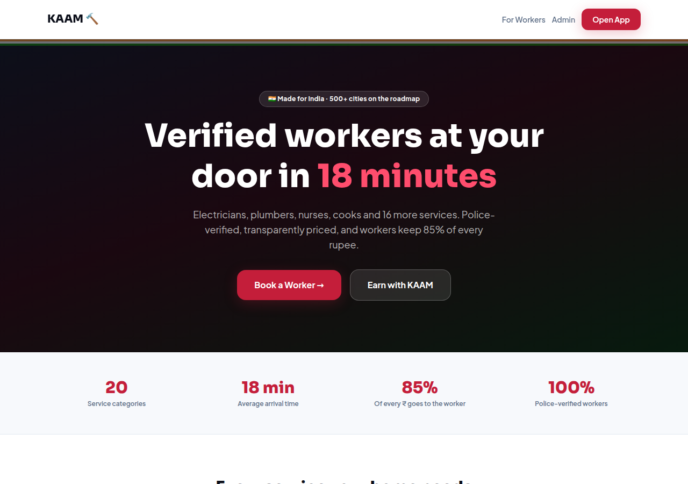
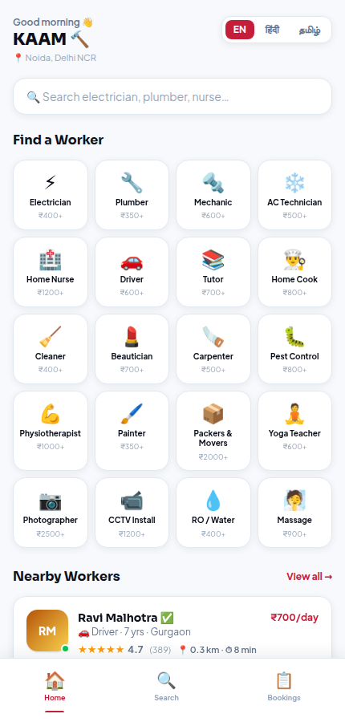
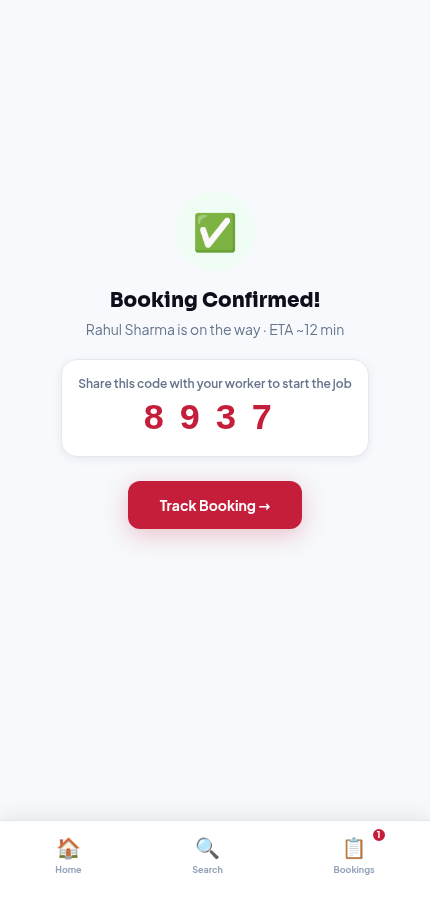
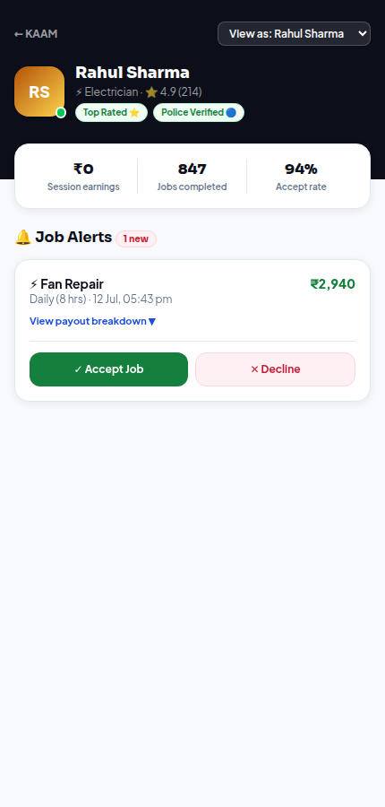

# KAAM 🔨 — India's Uber for Services

**Verified workers at your door in 18 minutes.** Electricians, plumbers, nurses, cooks and 16 more categories — police-verified, transparently priced, and workers keep 85% of every rupee.

This repository is the professional web application for KAAM: a Next.js + TypeScript codebase with three surfaces (user app, worker portal, admin dashboard), a fully-tested pricing & tax engine, and a smart-matching algorithm — built to the spec in the KAAM Production Build Guide.



## Quick start

```bash
npm install
npm run dev        # http://localhost:3000
npm test           # domain-layer unit tests (vitest)
npm run build      # production build
```

## The four surfaces

| Route | Surface | What it does |
| --- | --- | --- |
| `/` | Marketing site | Hero, live category grid, how-it-works, worker value proposition |
| `/app` | **User app** (mobile-first, 430 px shell) | Browse 20 categories, search & filter workers ranked by match score, view profiles, book with a 3-step wizard, pay, track bookings, rate workers |
| `/worker` | **Worker portal** | Live job alerts, accept/decline, OTP job start, slide-to-finish, per-job payout breakdown, session earnings |
| `/admin` | **Admin dashboard** ("God View") | GMV / revenue / GST / TDS KPIs, real-time booking ledger, worker roster with match scores, KYC verification queue |

Bookings created in the user app appear **live** in the worker portal and admin ledger (shared client-side store standing in for the production API).

| User app | Booking confirmed | Worker job alert |
| --- | --- | --- |
|  |  |  |

## Business logic (fully unit-tested)

The pricing engine in [`src/lib/pricing.ts`](src/lib/pricing.ts) implements the complete money flow from the build guide §2:

```
User pays  = service amount + GST @18% (remitted as TCS) + state welfare cess
Worker gets = service amount − 15% platform fee − 1% TDS (Sec 194-O)
```

- **Tenure multipliers** — Hourly ×1 · Half Day ×3.5 · Daily ×7 · Weekly ×42 · Monthly ×168 · 3 Months ×480
- **Surge pricing** — ×1.2 when a worker is in high demand
- **State welfare cess** — Rajasthan 2% · Karnataka 1.5% · Maharashtra 1% (collected & remitted)
- **Smart matching** ([`src/lib/matching.ts`](src/lib/matching.ts)) — proximity 35 + rating 30 + accept-rate 20 + volume 15, online workers ranked first
- **i18n** — English, हिंदी, தமிழ், മലയാളം with persistent language selection

The tests in `src/lib/__tests__/` verify the guide's canonical example exactly: a ₹500/visit Daily booking → user pays **₹4,130**, KAAM earns **₹525**, government receives **₹665** (GST + TDS), worker takes home **₹2,940**.

## Architecture

```
src/
├── app/                  # Next.js App Router
│   ├── page.tsx          # marketing landing
│   ├── app/              # user app (layout = 430px mobile shell + bottom nav)
│   │   ├── search/       # search + category filters
│   │   ├── worker/[id]/  # worker profile
│   │   ├── book/[id]/    # 3-step booking wizard → payment → OTP
│   │   └── bookings/     # tracking + ratings
│   ├── worker/           # worker portal
│   └── admin/            # admin dashboard
├── components/           # shared UI (cards, avatars, quote breakdown, nav)
├── data/                 # seed categories + worker roster
└── lib/                  # framework-free domain layer
    ├── pricing.ts        # tax/commission engine  ← unit tested
    ├── matching.ts       # ranking algorithm      ← unit tested
    ├── bookings.ts       # client store (localStorage, useSyncExternalStore)
    ├── i18n.ts           # en / hi / ta / ml dictionaries
    └── types.ts          # domain model
```

The domain layer (`src/lib`, `src/data`) has **zero framework dependencies** — it is designed to be lifted verbatim into the production Node.js API and the React Native app.

## Path to production

Per the build guide, this codebase is Phase 1 of the roadmap. The client-side store is a stand-in for the production stack:

| Concern | Demo (this repo) | Production |
| --- | --- | --- |
| Bookings & payments | localStorage store | PostgreSQL (Supabase) + Razorpay Route auto-split |
| Live status / chat | seeded data | Firebase Firestore + FCM |
| Auth & KYC | "view as" selector | OTP (MSG91) + HyperVerge/DigiLocker |
| AI Advisor | — | Claude API problem analysis → category match |
| Mobile | responsive 430px shell | React Native (Expo), reusing `src/lib` |

---

© 2026 KAAM Technologies Pvt. Ltd. — Made in India 🇮🇳
